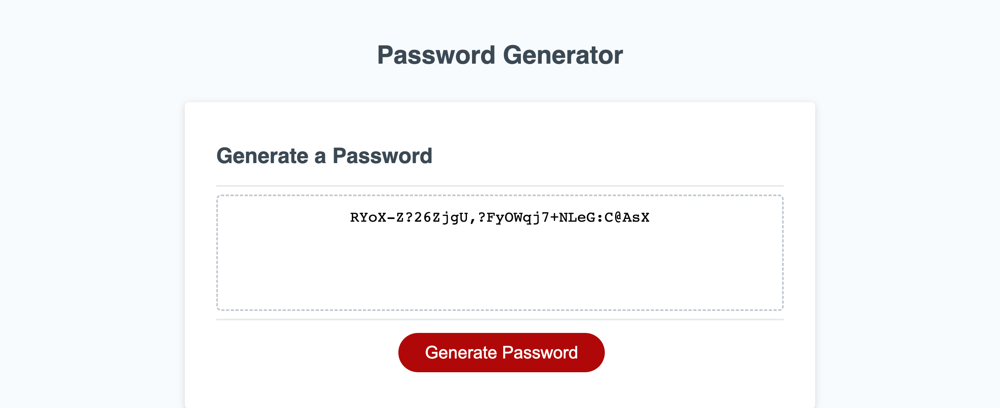

# password-generator

## Description 

This aims of this project are to use JavaScript to create random passwords with customizable length and complexity, specified by the user, then have them displayed in the browser.

During the process of creating this web page, I hit several roadblocks on the journey,  though these ultimately led to a much deeper understanding of loops and functions, along with their interactions with each other, particularly when looping a function and returning the outcome.

The code has been written with consideration given to future usage, therefore multiple functions were created which can be modified, or used to solve future projects with similar requirements. 

## Link to deployed site

Please check out the deployed [JavaScript project](https://stuart540.github.io/password-generator/)

## Usage 

This page is intended to run in the browser, with all variables being obtained from prompts and confirms, before generating then displaying the password directly to the web page.

## Credits

Many thanks to Jonas Schmedtmann and his [JavaScript course on Udemy](https://www.udemy.com/course/the-complete-javascript-course/) which has helped consolidate my knowledge and learn more about functions in JavaScript.

## License

This project is licensed under the standard MIT license
